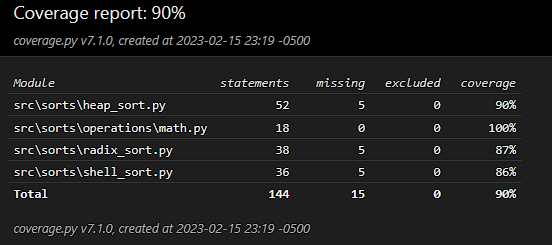

# Python Sorting Algorithms

Some sorting algorithms written in Python 3

## Description

Includes the implementation of popular sorting algorithms. This repo contains the following algorithms:
* Heap sort
* Shell Sort
* Radix Sort

## Getting Started

### Dependencies

* Python 3.10.2
* Command line

### Program execution (Windows 10)

* Open the console in the project root
* If you are going to create a local environment follow the next instructions
  * Run ```python -m venv myenv```
  * Run ```.\myenv\Scripts\activate```
* To run tests ```python -m unittest discover```
* To run the app ```python app.py```

### Coverage report



To replicate the coverage report, run:
* Run the tests with coverage ```python -m coverage run -m unittest discover```
* Generate the HTML report ```python -m coverage html```
* Open the report [file](htmlcov/index.html)

## Authors

Contributors names and contact info

- [alejovasquero](https://github.com/alejovasquero)

## Version History

* 1.0
    * Initial version

## License

This project is licensed under the GPL GNU License - see the [LICENSE.md](/LICENSE) file for details

## Acknowledgments

* Some readme snippets and the data generator were inspired from https://github.com/niquefa/python-simple-experimental-algorithm-comparison